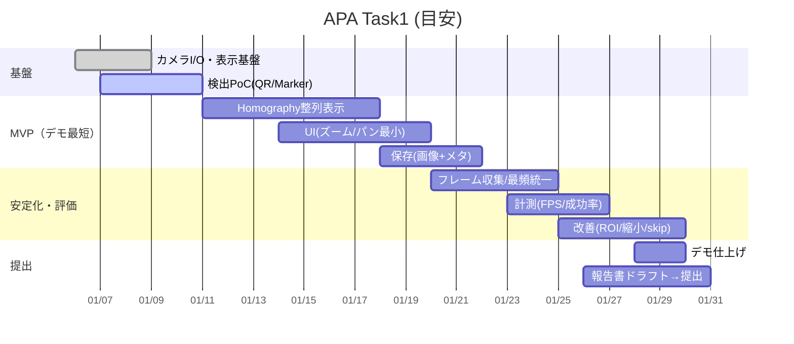
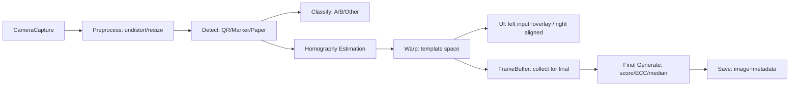

# APA - Automatic Paper Alignment（カメラ映像から紙フォームを自動整列）

この README は、`APA/document/order/Task1_RQ_v1(.1).pdf` のタスク指示と、確定方式である `APA/document/plan/myplan.txt` をもとに、
**このリポジトリで今後どうタスクを進めるべきか**を整理し、実装・検証・デモ・報告書作成までの流れをわかりやすくまとめたものです。

---

## 0. まず最初に：タスク書（PDF）をどう解釈したか

タスク書の要求は一言でいうと、次です。

> **カメラ映像に写った紙フォームを、種類（A/B/その他）ごとに識別し、テンプレート座標系へ透視変換で整列し、リアルタイムに「入力映像＋オーバーレイ」と「整列結果」を並べて表示する。必要なら保存もできる。**

### 入力 → 処理 → 出力の理解

| 区分       | タスク書の要求                                 | 私の解釈（実装に落とすとこうなる）                                                          |
| ---------- | ---------------------------------------------- | ------------------------------------------------------------------------------------------- |
| 入力       | カメラのライブ映像                             | `cv2.VideoCapture` で連続フレーム取得（できれば別スレッドで安定化）                         |
| 検出       | マーカー/QR/その他特徴で紙フォームを識別       | **強い特徴点（QR/マーカー）を最優先**で検出し、検出できない時だけ紙輪郭推定にフォールバック |
| 位置合わせ | 特徴点から透視変換                             | 4 点対応（または複数点）から **Homography** を推定し、テンプレサイズへ `warpPerspective`    |
| 表示       | 左：カメラ映像＋オーバーレイ、右：整列画像     | 2 ペイン表示（サイズ変更が望ましい）＋左には marker/bbox/角度（矢印）を描画                 |
| 操作       | 整列後にズーム/パン                            | UI 上で整列画像を拡大縮小・移動できること（方式は後述の 3 案で提案）                        |
| 保存       | 必要なら保存（タイムスタンプ付き）             | トリミング後、指定フォルダに画像保存＋メタ情報（フォーム ID 等）も保存                      |
| 制約/品質  | リアルタイム遅延を避ける、オフライン可、最適化 | CPU 中心の軽量パイプライン。重い処理は「保存ボタン押下時」へ寄せる                          |

### スケジュール要件の解釈（重要）

- 期間：**1/5〜2/6（約 1 か月）**
- レポート提出：**2026/1/30**
- デモ提出：**締切の 1 週間前まで**（≒ **2026/1/30 頃までにデモを形にする必要**）

つまり、**遅くとも 1/30 時点で「動くデモ＋やり方の説明（調査報告）」が揃っている状態**を作るのが最優先です。

---

## 1. リポジトリ現状（精査結果）

### 1.1 ディレクトリ構成（要点）

```
APA/
  README.md                 # ← 本ファイル（これからタスクの流れを記述）
  test_camera.py             # カメラアクセス＆簡易認識（顔検出）テスト
  document/
    order/                   # タスク指示（PDF）・カメラ仕様
    plan/                    # 進め方方針（myplanが確定）
    prompt/                  # 過去プロンプトログ
    report/                  # 作業レポート（例：カメラテスト）
  image/                     # A/B/Cの画像置き場（今後、テンプレ/サンプル/保存先として活用）
  trash/                     # 一時ファイル置き場
```

### 1.2 既にできていること（地盤）

- `test_camera.py`：

  - カメラ検出（index 0-4）
  - 720p/30fps の設定（Logitech C270 想定）
  - リアルタイムプレビュー＆オーバーレイ例
  - 画像保存（`captured_images`）

- `document/report/1_20260106_カメラテスト.md`：
  - OpenCV 導入と動作確認
  - 720p 時に実測 FPS が落ちやすい（顔検出で約 20fps になる）という知見

### 1.3 カメラ仕様（ボトルネック前提）

`document/order/camera_performance.md` より：

- 最大解像度：**720p / 30fps**

このため、**処理は「720p の表示」は維持しつつ、検出用は縮小して軽量化**が重要になります。

---

## 2. 確定方式（myplan.txt）の要点（この方式で進める）

`APA/document/plan/myplan.txt` は、タスク書要件を「現実的に達成するための分割戦略」になっています。
ここがブレると破綻しやすいので、以降の実装/進め方は **myplan 準拠** で統一します。

### 2.1 パイプライン全体像（myplan の流れ）

```mermaid
flowchart TD
  A[1. 入力: カメラフレーム取得] --> B[歪み補正: undistort]
  B --> C{2. 検出: 強い特徴点は見つかる?}
  C -->|Yes| D[QR/マーカー検出 → ROI確定]
  C -->|No| E[紙検出(輪郭/直線) → ROI推定]
  D --> F[3. フォーム種別判定(A/B/その他)]
  E --> F
  F --> G[4. フレーム収集/安定化: 最頻フォームに統一]
  G --> H{5. ボタン押下?}
  H -->|No| I[リアルタイム表示: 入力+オーバーレイ / 整列プレビュー]
  H -->|Yes| J[高品質生成: Homography蓄積→選別→高精度化(ECC等)→合成]
  J --> K[6. 保存: 画像+メタ情報]
```

### 2.2 設計思想（なぜこうするか）

- **リアルタイム処理は CPU 中心で軽量優先**
- **重い処理は最終生成（ボタン押下）に集約**
- 検出は **QR/マーカー（強い特徴）を最優先**、紙輪郭はフォールバック

`reason_myplan.txt` にもある通り、紙検出よりマーカー検出の方が軽量・頑健になりやすいのが理由です。

---

## 3. 要件整理（必須機能／任意機能／非機能／制約）

ここは「実装の漏れ」を防ぐため、**チェック可能な形**に落とします。

### 3.1 機能要件（Must / Should / Could）

|   優先 | 要件                         | 具体化（実装上の論点）                     | 完了条件（例）                      |
| -----: | ---------------------------- | ------------------------------------------ | ----------------------------------- |
|   Must | 用紙の位置合わせ（透視変換） | Homography 推定 → テンプレ座標へ warp      | 斜め撮影でもテンプレ枠へ収まる      |
|   Must | フォーム A/B 識別            | A=マーカー、B=QR（タスク書）               | A/B を取り違えない（ログで確認）    |
|   Must | リアルタイムプレビュー       | 左：入力＋ overlay、右：整列               | 目視で遅延が許容範囲（目安 <200ms） |
|   Must | オーバーレイ表示             | marker/bbox/整列角度（矢印）               | 検出が視覚的に確認できる            |
|   Must | Python で実装（API を書く）  | FastAPI 等でも、まずはモジュール分割でも可 | 実行手順が README に記載される      |
| Should | 整列後のズーム/パン          | UI 実装方式が必要                          | マウス/キー等で操作できる           |
| Should | 保存（タイムスタンプ付き）   | 画像＋メタ（フォーム ID 等）               | 指定フォルダに保存される            |
| Should | オフラインで動作             | 依存関係はローカルで完結                   | ネット未接続でも実行可              |
| Should | 新フォーム追加容易性         | テンプレ/特徴定義の追加手順                | 追加手順がドキュメント化            |
|  Could | 高品質合成（影/反射に強い）  | median 合成など                            | 保存画像の品質が改善                |
|  Could | ECC 微調整（重い）           | 最終生成だけで実行                         | 位置ズレがさらに減る                |

### 3.2 非機能要件（パフォーマンス/運用）

| 観点           | 要求                             | 実装ガイド                                             |
| -------------- | -------------------------------- | ------------------------------------------------------ |
| リアルタイム性 | 認識〜表示遅延を避ける           | 検出用に縮小、ROI 限定、フレームスキップ、スレッド分離 |
| 最適化         | CPU/GPU/メモリ配慮               | 「プレビュー軽量」「最終生成で重処理」へ分離           |
| 安定性         | カメラ揺れ/傾き/部分隠れでも検出 | 強い特徴点優先＋フォールバック＋履歴で安定化           |
| 品質           | 高解像度、照明均一、ノイズ最小化 | 保存時のみ高解像度再ワープ、画質スコア選別、合成       |

---

## 4. 進め方（確定方式を“実装計画”に落とす）

ここからがこの README の本題です。
「何をどの順で作ると、期限内にデモと報告書が揃うか」を、**作業単位（マイルストーン）**に分解します。

### 4.1 マイルストーン案（期限ベース）

| 期日目安 | マイルストーン           | 成果物                                             |
| -------- | ------------------------ | -------------------------------------------------- |
| 〜1/10   | 検出の土台               | QR 検出/ArUco 検出の PoC、オーバーレイ表示         |
| 〜1/17   | 位置合わせの土台         | Homography→ 整列表示（右ペイン）                   |
| 〜1/24   | 安定化＋保存             | フレーム収集、最頻フォーム統一、保存（画像＋メタ） |
| 〜1/30   | **デモ＋報告書ドラフト** | 動くデモ、計測、設計と手順の説明                   |
| 〜2/6    | 仕上げ                   | 改善、追加フォーム、最適化、最終提出               |

### 4.2 作業の進行ルール（おすすめ）

- **必ず「左＝入力＋オーバーレイ」「右＝整列結果」表示を崩さない**
  - “動いているデモ”が常に存在する状態で改善する
- 1 機能を足すたびに
  - ログ（FPS/検出率/失敗理由）
  - スクショ/短い動画
  - `APA/document/report/` の作業レポート
    を残す（報告書が書きやすくなる）

### 4.3 成果物（提出物）を先に固定する

タスク書の要件（「Python で実装」「調査報告書を提出」「デモ提出」）から、最低限そろえる成果物は次です。

| 種別 | 成果物                                             | 目的                                                        |
| ---- | -------------------------------------------------- | ----------------------------------------------------------- |
| デモ | **動くデモ（リアルタイム表示 + 整列結果 + 保存）** | 要件を実際に満たすことの証明                                |
| 報告 | **調査報告書（やり方・設計・評価・課題）**         | 1/30 提出用。後から思い出して書かないために、作業ログを蓄積 |
| 再現 | **実行手順（環境・コマンド）**                     | 別 PC/別日でも再現できるようにする                          |
| 記録 | **測定結果（FPS/遅延/成功率）**                    | 「最適化に留意」の客観証拠                                  |

> ポイント：**「実装が進んだ」ではなく「提出できる形になった」**をゴールにする。

### 4.4 期限から逆算したガント（目安）



---

## 5. 実装を進めるための「3 つの案」

ここでは、同じ要件（myplan 準拠）を満たすための **実装・進め方の選択肢**を 3 案提案します。

### 案 1：OpenCV だけで完結（最短でデモを作る MVP）

**狙い：** とにかく早く動くものを作り、期限内デモを最優先。

- UI：`cv2.imshow` で左右結合表示（1 ウィンドウ）
- ズーム/パン：キーボード操作で ROI を動かす簡易方式（まず要件を満たす）
- API：まずは Python モジュール（後で FastAPI 化も可能）

**メリット**：依存が少ない、最短で動く、デバッグが容易

**デメリット**：UI が弱い（サイズ変更やズーム/パンが作り込みにくい）

### 案 2：FastAPI + Web UI（バランス型：API 要求と UI 要求を両立）

**狙い：** 「Python で API を書く」要件と、「ズーム/パン」等の UI 要件を両立。

- Backend：FastAPI（フレーム取得・検出・整列をサービス化）
- Frontend：ブラウザで表示（Canvas でズーム/パンが作りやすい）
- 通信：WebSocket でフレーム配信（JPEG/PNG 圧縮）

**メリット**：UI 要件を満たしやすい／API 成果物として説明しやすい

**デメリット**：構成がやや複雑（ただし“期限内デモ”には強い）

### 案 3：高品質生成に寄せた二段階パイプライン（研究寄り・上振れ狙い）

**狙い：** myplan の「最終生成のみ重処理」を徹底し、保存品質を上げる。

- リアルタイム：検出は軽量化（縮小＋ ROI、フレームスキップ）
- 最終生成：
  - 高解像度で再ワープ
  - ECC で微調整
  - median/外れ値除去平均で合成

**メリット**：保存画像の品質が高く、報告書で“工夫点”が作りやすい

**デメリット**：実装/検証の項目が増える（MVP が遅れるリスク）

### 3 案の比較表

| 観点               | 案 1: OpenCV 完結 | 案 2: FastAPI+Web | 案 3: 二段階高品質 |
| ------------------ | ----------------- | ----------------- | ------------------ |
| デモ到達速度       | ◎ 最速            | ○                 | △                  |
| UI（ズーム/パン）  | △                 | ◎                 | ○                  |
| 「API を書く」説明 | △（後付け）       | ◎（自然）         | ○                  |
| 品質（保存画像）   | ○                 | ○                 | ◎                  |
| 実装難易度         | ○                 | ○〜△              | △〜×               |

**おすすめ**：

- まず **案 1 で MVP を最速構築** → 期限が見えたら **案 2 へ拡張**（UI 改善＆API 化） → 余力があれば **案 3 要素（合成/ECC）を追加**

---

## 6. 推奨アーキテクチャ（モジュール分割のたたき台）

実装が肥大化しやすいので、最初から “責務” を切ります。



---

## 7. 実装・検証で特に注意すべき点（必須の目配り）

### 7.1 検出の優先順位（myplan 準拠）

1. **QR / マーカー検出（最優先）**
2. 見つからない場合のみ **紙検出（フォールバック）**

理由：速度・頑健性・誤検出率の面で有利。

### 7.2 パフォーマンス戦略

- 検出は縮小画像で行う（例：幅 640 へ縮小）
- 見つかったら ROI で後段を狭める
- 高解像度（720p）のまま毎フレーム重い処理をしない
- 最終生成は「ボタン押下時のみ」重処理 OK

### 7.3 収集と統一（混在防止）

- フレーム収集中に **最頻フォーム種別**を採用して統一
- 採用フォーム以外は破棄
- これにより「A/B が混ざって合成が崩れる」事故を防ぐ

---

## 8. 次にやるべき具体タスク（チェックリスト）

### 8.1 MVP（デモ最短）

- [ ] QR 検出（OpenCV `QRCodeDetector` など）
- [ ] マーカー検出（ArUco 等）
- [ ] 検出結果のオーバーレイ（bbox/角度矢印）
- [ ] Homography 推定 → 右ペインに整列画像表示
- [ ] 最低限のズーム/パン（キー操作でも可）
- [ ] 保存（タイムスタンプ + フォーム ID）

### 8.2 “報告書が書ける状態”にする

- [ ] FPS/遅延（簡易計測）
- [ ] 検出成功率（何回中何回）
- [ ] 失敗例と改善案（照明/反射/傾き/部分隠れ）
- [ ] `APA/document/report/` に作業ログを継続追加

---

## 9. レポート（作業ログ）運用ルール（このリポジトリの約束事）

`APA/document/prompt/template.txt` の指示に従い、タスクを進めたら **成功後に必ずレポートを書きます**。

### 9.1 レポートの置き場所・命名規則

- 保存先：`APA/document/report/`
- ファイル名：`番号_年月日_行ったことを日本語.md`
  - 例：`2_20260110_QR検出PoC.md`
- `番号` は `APA/document/report/` 内の既存番号の続きから採番します。

### 9.2 レポートに最低限書くべき項目（テンプレ）

> 重要：Markdown の「コードブロック内にコードブロック」を入れると崩れやすいので、テンプレは 1 つのコードブロックで完結させます。

> 補足：ファイル名は命名規則どおり **`2_YYYYMMDD_タイトル.md`** の形式にしてください（本文の見出しは自由です）。

```
# タイトル

## 目的

## 実施内容

### 変更したファイル

-

### 実行コマンド

- 例：
  - `python -m pip install -r requirements.txt`
  - `python main.py`

## 結果（スクショ/数値）

- FPS:
- 成功率:

## 課題と次の一手
```

## 10. 実装時の補足（誤解しやすいポイント）

### 10.1 「フォーム A の 3 つの正方形マーカー」について

タスク書ではフォーム A は「四隅に 3 つの正方形マーカー」とされています。
実装上は、以下のいずれかで **4 点対応（Homography 用）**を作る必要があります。

- マーカーを 3 点 + 紙輪郭で 4 点目を補う
- マーカーの配置ルール（テンプレ側の期待座標）から 4 点相当を導出する
- そもそも ArUco 等の「ID 付きマーカー」を採用し、4 隅検出に寄せる（可能なら）

※このあたりは実物フォーム（A/B の画像・テンプレ）が揃った段階で確定させるのが安全です。

### 10.2 「ズーム/パン」は“整列画像側”を対象にする

タスク書の文脈上、ズーム/パンは **右側（Aligned Template）**で「フォーム詳細を見る」ことが目的です。
そのため、まずは右ペインに対して操作を入れ、左（入力）は補助表示に徹するのが進めやすいです。

---

## 参考資料（このリポジトリ内）

- タスク指示：
  - `APA/document/order/Task1_RQ_v1.pdf`
  - `APA/document/order/Task1_RQ_v1.1.pdf`
- 確定方式（実装方針）：`APA/document/plan/myplan.txt`
- myplan 採用理由メモ：`APA/document/plan/reason_myplan.txt`
- カメラ仕様：`APA/document/order/camera_performance.md`
- カメラ動作確認レポート：`APA/document/report/1_20260106_カメラテスト.md`
