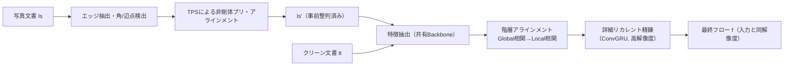
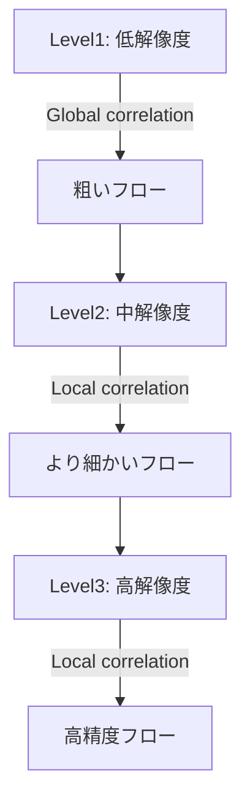

# DocAligner 論文まとめ（日本語・詳細解説）

対象論文: **DocAligner: Annotating Real-world Photographic Document Images by Simply Taking Pictures**（arXiv:2306.05749v2, 2023/06/12）

> この Markdown は、論文本文の内容を**日本語で詳細に要約し、背景・意義・設計意図が分かるように解説**したものです。
> 原文の逐語訳や全文転載ではなく、要点を再構成して説明しています。

---

## 目次

- [1. 研究の背景と課題](#1-研究の背景と課題)
- [2. DocAligner の狙い（何を解決するのか）](#2-docalignerの狙い何を解決するのか)
- [3. 手法の全体像](#3-手法の全体像)
- [4. 提案手法の中身（3 つの工夫）](#4-提案手法の中身3つの工夫)
  - [4.1 非剛体プリ・アラインメント（エッジ＋ TPS）](#41-非剛体プリアラインメントエッジtps)
  - [4.2 階層アラインメント（Global→Local の相関＋粗密フロー）](#42-階層アラインメントgloballocalの相関粗密フロー)
  - [4.3 詳細リカレント精錬（高解像度での ConvGRU）](#43-詳細リカレント精錬高解像度でのconvgru)
  - [4.4 実データ自己教師（Sobel 勾配整合）](#44-実データ自己教師sobel勾配整合)
- [5. データセット（DocAlign12K）合成](#5-データセットdocalign12k合成)
- [6. 実験設定](#6-実験設定)
- [7. 比較実験（SOTA との比較）](#7-比較実験sotaとの比較)
- [8. 応用：撮るだけで「現実写真ドキュメント」の教師データが増える](#8-応用撮るだけで現実写真ドキュメントの教師データが増える)
  - [8.1 レイアウト解析（DLA）への応用](#81-レイアウト解析dlaへの応用)
  - [8.2 照明補正への応用](#82-照明補正への応用)
  - [8.3 幾何補正（デワーピング）への応用](#83-幾何補正デワーピングへの応用)
- [9. アブレーション（どの工夫が効いているか）](#9-アブレーションどの工夫が効いているか)
- [10. 限界・失敗例](#10-限界失敗例)
- [11. まとめ（この研究の価値）](#11-まとめこの研究の価値)

---

## 1. 研究の背景と課題

近年のドキュメント AI（OCR、レイアウト解析、表検出、文書復元など）は、**スキャン画像や PDF 由来の「綺麗な文書」**に対して大きく進歩してきました。

一方で実世界では、スマホ撮影の領収書・資料・掲示物・教科書など、**写真（photographic）文書画像**が大量に存在します。写真文書は次のような劣化を持ちます。

- 視点変化（斜め撮り）による大域的なズレ
- 紙の湾曲・折れ・たわみによる**非剛体変形**
- 影、照明ムラ（シェーディング）、反射
- 背景の写り込みや余白（机・床など）

しかし、ここで大きな問題が発生します。

### 問題：写真文書の「正解ラベル」が作れない

写真文書でモデルを学習させるにはラベルが必要ですが、以下の理由で難しい。

- **手作業のアノテーションが高コスト**（物体数が多い、変形が複雑、数分〜十数分/枚）
- 照明補正や幾何補正は、画素単位での対応関係（フロー）など、**人手でほぼ不可能な超密なラベル**が必要
- 既存の「クリーン文書用自動ラベリング」（PDF 解析など）は写真には適用できない

---

## 2. DocAligner の狙い（何を解決するのか）

DocAligner の発想はシンプルです。

> **「クリーンな文書画像（例：PDF から作れる）を印刷して写真を撮る」**
> そのクリーン画像と撮影画像の間に、画素レベルの対応（dense correspondence / flow）を推定できれば、
> **クリーン側に既にあるアノテーションを写真側に移し替えられる**。

つまり、写真文書データセットの作り方を

- 従来：写真を撮る → 1 枚ずつ手作業でラベル付け
- 提案：クリーン画像（元データ）を用意 → 印刷して撮影 → **対応付けで自動ラベル転送**

に変えることで、データ不足を根本から改善します。

特に次の 2 種類のラベル獲得が可能になります。

1. **既存タスクのラベル転送**：レイアウト解析、表検出など（bbox やマスク）
2. **人手で付けられないラベルの自動生成**：照明補正の教師（補正後画像）、幾何補正の教師（密な対応・デワーピングマップ）

---

## 3. 手法の全体像

DocAligner は、撮影画像（source）とクリーン画像（target）の間のフロー（各画素がどこへ対応するか）を推定します。

- 入力: 写真文書 `I_s` と、対応するクリーン文書 `I_t`
- 出力: フロー `f`（`I_t` の各画素が `I_s` のどの位置に対応するか）

論文では主に次の流れです。



ポイントは、自然画像の dense correspondence 手法（DGC-Net, GLU-Net など）をそのまま使うのではなく、**文書ならではの性質**（繰り返しパターン、微細文字、非剛体変形）に合わせた設計をしている点です。

---

## 4. 提案手法の中身（3 つの工夫）

論文の技術的貢献は大きく 4 つに整理できます。

1. **非剛体プリ・アラインメント（TPS）**
2. **階層アラインメント（Global→Local 相関）**
3. **詳細リカレント精錬（ConvGRU で高解像度フロー）**
4. **実データ自己教師（Sobel 勾配整合）**

以下で順に解説します。

---

### 4.1 非剛体プリ・アラインメント（エッジ＋ TPS）

#### なぜ必要？

写真文書は、撮影角度の違いや紙のたわみで、**大域的に大きくズレる**ことが多いです。
このズレがあると、相関（特徴の類似度）を取る段階で、繰り返しパターン（同じ文字や同じ行構造）に引っ張られて誤対応が起きやすくなります。

自然画像では、RANSAC ＋ホモグラフィなどの剛体（あるいは準剛体）変換で粗合わせすることがありますが、文書では**非剛体変形（湾曲・折れ）**が強く、それだけでは足りません。

#### 何をする？

1. 文書領域のエッジをセグメンテーションで抽出
2. エッジから 4 隅＋辺上の等間隔点を検出
3. それらを「基準の四角形」上の参照点に対応付け
4. 対応点対から **TPS（Thin Plate Spline）** で非剛体変換し、`I_s'`（プリ・アライン後の画像）を得る

TPS は「薄い板を点で引っ張って変形させる」ような滑らかな非剛体変形を表現でき、紙のたわみに相性が良い設計です。

---

### 4.2 階層アラインメント（Global→Local の相関＋粗密フロー）

#### 目的

大きなズレから微細なズレまでを、

- 低解像度で大きく合わせる（粗）
- 高解像度で細部を詰める（密）

という「粗 → 密」の戦略で推定します。

#### 中身（直感）

各レベル `l` でフロー `f^l` を更新します。

1. いまのフローで source 特徴を target 側へワープしてズレを減らす
2. 相関（correlation / cost volume）を計算して対応候補を集める
3. 軽量デコーダでフロー残差を予測して更新

#### Global correlation と Local correlation の使い分け

- **Global correlation（全探索）**：

  - 低解像度でのみ使う
  - 大きなズレに強いが、計算量・メモリが二乗で増える

- **Local correlation（近傍探索）**：
  - 高解像度で使う
  - 近傍 `R` の範囲だけを見るので効率的だが、大ズレには弱い

DocAligner はこれを組み合わせて、

- Level 1（最粗）: Global correlation
- Level 2, 3（より細）: Local correlation（論文では `R=9`）

としています。



---

### 4.3 詳細リカレント精錬（高解像度での ConvGRU）

#### 背景：文書は「文字の境界」が命

自然画像のオプティカルフローでは、最終出力フローが入力の 1/4 解像度でも十分なことが多いのに対し、文書は

- 文字
- 罫線
- 表のセル境界

など、**高周波の細部が認識の成否を左右**します。

そのため DocAligner は、最終フローを**入力と同解像度**まで高精度にします。

#### どうやって高解像度を扱う？（メモリ問題）

高解像度で相関計算やデコーダを回すとメモリが爆発します。そこで論文は、

- 高解像度空間での精錬を
- **リカレント（反復）**に実行し
- 状態を **ConvGRU** に保持する

ことで、精度とメモリのバランスを取ります。

直感的には「毎回ちょっとずつフローを修正し、過去の修正履歴を隠れ状態に蓄える」イメージです。

また、残差フローのアップサンプリングに、単純な双線形補間ではなく「学習可能な重み（3×3 近傍の重み和）」を使っている点が特徴です。

---

### 4.4 実データ自己教師（Sobel 勾配整合）

#### なぜ自己教師が必要？

合成データで学習しても、実写には

- 現実の影・反射
- 紙質や印刷品質
- 背景混入

といった分布差があり、そのままだと性能が落ちます。

しかし実写で GT フローを作るのは困難。
そこで論文は、**自己教師（Self-supervised fine-tuning）**を提案します。

#### アイデア

フローでワープして一致させたいのは「見た目」ですが、照明差があると画素値一致は難しい。
そこで、画像勾配（Sobel）を使います。

- `G(·)`：Sobel で勾配画像を取る
- `I_s'` をフロー `f` でワープして `\\tilde{G}(I_s')` を作る
- `G(I_t)` と `\\tilde{G}(I_s')` の差を最小化

この最適化を各サンプル単独ではなく、**テストセット全体をまとめて数 epoch 微調整してから推論**する運用にしています（論文中では SSFT10 など）。

---

## 5. データセット（DocAlign12K）合成

学習用の教師ありデータが無いので、論文は **DocAlign12K（12K サンプル）** を合成します。

### 合成の基本方針

1. インターネットから PDF を収集
2. PDF→ 画像変換でクリーン画像を作る（これが `I_t`）
3. ランダムなフローを生成し、クリーン画像をワープして幾何歪みを作る（reflectance 相当）
4. 実写背景を撮影して集めた**シェーディングマップ（500 枚）**を適用し、照明ムラを付与
5. JPEG 圧縮、ノイズ、ブラー等も追加して現実っぽくする

結果として、

- (クリーン画像, 合成写真風画像, GT フロー)

の三つ組を得ます。

```mermaid
flowchart LR
  A[PDF収集] --> B[PDF→クリーン画像 It]
  B --> C[ランダムフロー生成]
  C --> D[幾何ワープ（歪み付与）]
  E[実写シェーディング500枚] --> F[クロップ/回転/色変化]
  D --> G[照明劣化 I = R ⊗ S]
  F --> G
  G --> H[JPEG/ノイズ/ブラー等]
  H --> I[DocAlign12K (12K)]
```

分割は **学習 10K / テスト 2K**。

---

## 6. 実験設定

- 実装: PyTorch
- Backbone: ImageNet 事前学習の ResNet-18
- 入力解像度: 1024×1024
- 学習: Adam、初期 LR=1e-4、30epoch ごとに ×0.3、計 100epoch
- GPU: NVIDIA 2080Ti ×2、batch size 4
- 損失: 各階層レベル＋精錬反復のフローに対して **L1 loss**（合成データでは GT フローがある）

---

## 7. 比較実験（SOTA との比較）

比較対象：

- DGC-Net
- GLU-Net
- GLU-GOCor
- DocAligner（提案）

### 7.1 DocAlign12K 上の評価（AEPE / PCK）

指標：

- **AEPE**（Average Endpoint Error）: 予測フローと GT フローのユークリッド距離平均（小さいほど良い）
- **PCK**（Percentage of Correct Keypoints）: 閾値以内（例 1px, 5px）に収まる割合（大きいほど良い）

**表 1（論文の数値を整理）**

| 手法           |   AEPE ↓ | PCK-1px (%) ↑ | PCK-5px (%) ↑ |
| -------------- | -------: | ------------: | ------------: |
| DGC-Net        |    47.39 |          6.98 |         15.67 |
| GLU-Net        |     1.82 |         51.04 |         93.74 |
| GLU-GOCor      |     1.54 |         62.15 |         94.49 |
| **DocAligner** | **1.09** |     **76.63** |     **96.36** |

解釈：

- DGC-Net は入力解像度制約（240×240）の影響で文書の微細構造に弱い
- DocAligner は PCK-1px が大きく改善し、**1 ピクセル精度の対応付け能力が高い**ことを示す

### 7.2 DocUNet ベンチマーク（ワープ後の整合性）

DocUNet は、クリーン（スキャン）と歪んだ写真文書のペア。
予測フローで写真側をワープし、ターゲットへの整合性を測ります。

指標：

- **MS-SSIM** ↑: 知覚類似度（高いほど良い）
- **AD** ↓: align distortion（低いほど良い）

**表 2（論文の数値を整理）**

| 手法                    |  MS-SSIM ↑ |       AD ↓ | Params (M) | Run-time (s) |
| ----------------------- | ---------: | ---------: | ---------: | -----------: |
| DGC-Net                 |     0.6177 |     0.3137 |      68.47 |         0.48 |
| GLU-Net                 |     0.7728 |     0.1186 |      94.17 |         0.75 |
| GLU-GOCor               |     0.7862 |     0.0938 |      94.17 |         0.85 |
| **DocAligner**          | **0.8058** | **0.0486** |      103.8 |         0.93 |
| **DocAligner + SSFT10** | **0.8232** | **0.0445** |      103.8 |         0.93 |

解釈：

- 自己教師微調整（SSFT10）でさらに改善 → 分布差の吸収に効いている

### 7.3 自己教師のみでの比較（RANSAC-Flow と比較）

合成データ学習なしで、実データ自己教師だけで訓練した場合。

**表 3（論文の数値を整理）**

| 手法                    |  MS-SSIM ↑ |       AD ↓ |
| ----------------------- | ---------: | ---------: |
| RANSAC-Flow             |     0.6746 |     0.4700 |
| **DocAligner + SSFT10** | **0.7864** | **0.0918** |

解釈：

- RANSAC-Flow は剛体寄りの事前整列がボトルネックになりやすい
- DocAligner は非剛体プリ・アラインが強く、自己教師も実装しやすい構成

---

## 8. 応用：撮るだけで「現実写真ドキュメント」の教師データが増える

DocAligner の価値は、単にフロー精度が高いだけではなく、**現実写真の教師データを安価に増やすための基盤**になる点です。

論文では 3 つの応用を示します。

---

### 8.1 レイアウト解析（DLA）への応用

#### 何をする？

1. PubLayNet（クリーン画像＋レイアウト注釈）のサンプルを選ぶ
2. 印刷して写真撮影
3. DocAligner でクリーン ↔ 写真を対応付け
4. bbox/マスク座標をフローで変換して、写真側注釈を自動生成

#### 効果（コスト）

手作業だと 1 枚 5〜15 分程度かかるところ、
提案では **約 0.15 分/枚**まで短縮（論文記述）。

#### 学習効果（Mask R-CNN）

論文の表 4 は、訓練データの作り方が性能に与える影響を示します。

**表 4（論文の数値を整理）**

| Training data             | Type      | Num. | mAP(@0.5-0.95) |
| ------------------------- | --------- | ---: | -------------: |
| Clean images              | -         |   2K |            8.0 |
| Clean + S (Synthetic)     | Synthetic |   2K |           36.9 |
| Clean + G (Synthetic)     | Synthetic |   2K |           21.5 |
| Clean + G + S (Synthetic) | Synthetic |   2K |           49.7 |
| Clean + G + S (Synthetic) | Synthetic |  20K |           61.9 |
| **Data from DocAligner**  | Real      |   2K |       **68.0** |

解釈：

- 合成を大量（20K）作っても、DocAligner で得た実写 2K が上回る
- 「現実の多様性」を取り込めるのが強い

---

### 8.2 照明補正への応用

照明補正では「影や照明ムラを消した正解画像」が必要ですが、人手では作れません。

DocAligner は、写真をフローでクリーンに揃えられるので、

- 入力：歪んだ写真
- 正解：クリーン画像に整列した結果（ある種の疑似 GT）

というペアを作れます。

論文では WarpDoc を DocAligner でアノテートし、800 ペアを得て illNet を学習。

**表 5（論文の数値を整理：DocUNet 上の照明補正）**

| Network     | Training data               | Num. |     SSIM ↑ |    PSNR ↑ |
| ----------- | --------------------------- | ---: | ---------: | --------: |
| -（未補正） | -                           |    - |     0.7065 |     12.90 |
| illNet      | DocProj (synthetic)         |  500 |     0.7139 |     15.74 |
| illNet      | **Dataset from DocAligner** |  800 | **0.7504** | **16.78** |

解釈：

- 実写由来データ（800）が、合成データ（500）より高い
- 実データはサイズが小さくても「質」が勝ることを示唆

---

### 8.3 幾何補正（デワーピング）への応用

幾何補正（曲がった紙を平らにする）は、対応関係（デワーピングマップ）が必要で、手作業は困難です。

DocAligner でフローが得られれば、それ自体が教師信号になり、デワーピングモデルが学習できます。

論文では複数データセットを混ぜて 2.5K の訓練ペアを作成し、Transformer ベースのデワーピングネットを学習。

**表 6（論文の数値を整理）**

| Model                                      | Training data | Type |      Num. |  MS-SSIM ↑ |   AD ↓ |
| ------------------------------------------ | ------------- | ---- | --------: | ---------: | -----: |
| DocUNet [25]                               | Ma et al.     | S    |      100K |     0.4157 | 0.4957 |
| DocProj [22]                               | Li et al.     | S    |        1K |     0.2531 | 0.9278 |
| DDCP [40]                                  | Xie et al.    | S    |       30K |     0.4189 | 0.5071 |
| DewarpNet [5]                              | Doc3D         | S    |      100K |     0.4057 | 0.5187 |
| DocTr [8]                                  | Doc3D         | S    |      100K |     0.4649 | 0.4708 |
| PaperEdge [24]                             | DIW + Doc3D   | R+S  | 2.3K+100K |     0.4523 | 0.3901 |
| **Transformer-based + DocAligner dataset** | -             | R    |      2.5K | **0.4897** | 0.4226 |

解釈：

- たった 2.5K の実写由来データでも、巨大合成 100K で鍛えたモデル群に匹敵/一部上回る
- 「ラベル獲得のボトルネック」が解消されることのインパクトが大きい

---

## 9. アブレーション（どの工夫が効いているか）

論文は 2 点の重要性を検証しています。

### 9.1 非剛体プリ・アラインの有無

非剛体プリ・アラインをホモグラフィ（RANSAC）に置き換えると性能が大きく落ちる。

### 9.2 詳細リカレント精錬の有無

精錬をやめて 1/4 解像度フローを双線形拡大すると性能が落ちる。

**表 7（論文の数値を整理）**

| 非剛体プリ・アライン | 詳細リカレント精錬 |  MS-SSIM ↑ |       AD ↓ |
| -------------------- | ------------------ | ---------: | ---------: |
| なし                 | あり               |     0.7578 |     0.1099 |
| あり                 | なし               |     0.7910 |     0.0756 |
| **あり**             | **あり**           | **0.8058** | **0.0486** |

---

## 10. 限界・失敗例

論文の制限事項（Limitations）は実運用に重要なので、要点をまとめます。

1. **向き（orientation）のズレに弱い**

   - 非剛体プリ・アラインが「回転・上下反転を自動補正する設計ではない」
   - 撮影時に向きを揃える、または撮影後に人手で回転補正が必要

2. **文書が欠けている（incomplete）ケース**
   - 片方にしか存在しない領域があり、ワープ結果に無効領域（ゼロ埋め）が出る
   - 特に照明補正の教師としては不適になる

---

## 11. まとめ（この研究の価値）

DocAligner は、文書 AI における「写真文書のラベル不足」という根本問題に対し、

- **写真文書 ↔ クリーン文書** の高精度 dense correspondence（フロー）を推定することで、
- **撮影するだけで教師データが増える**

という実用的な解決策を提示しています。

技術的には、文書の特性に合わせて

- エッジを使った **TPS 非剛体プリ・アライン**
- **Global→Local 相関**による階層推定
- **ConvGRU**による高解像度の反復精錬
- **Sobel 勾配**に基づく実データ自己教師

を組み合わせ、既存手法より高い精度を実現しました。

そして最も大きな意義は、レイアウト解析・照明補正・デワーピングといった複数タスクで、

> **合成データよりも、少量の実写由来データが強い**

ことを実験で示し、研究コミュニティに「データの作り方」の新しいルートを提示した点です。

---

## 参考（論文中で言及される主要な関連手法）

- DGC-Net / GLU-Net / GLU-GOCor：自然画像の dense correspondence 系
- DocUNet / WarpDoc：文書デワーピング系ベンチマーク
- PubLayNet：クリーン文書のレイアウト解析データセット
