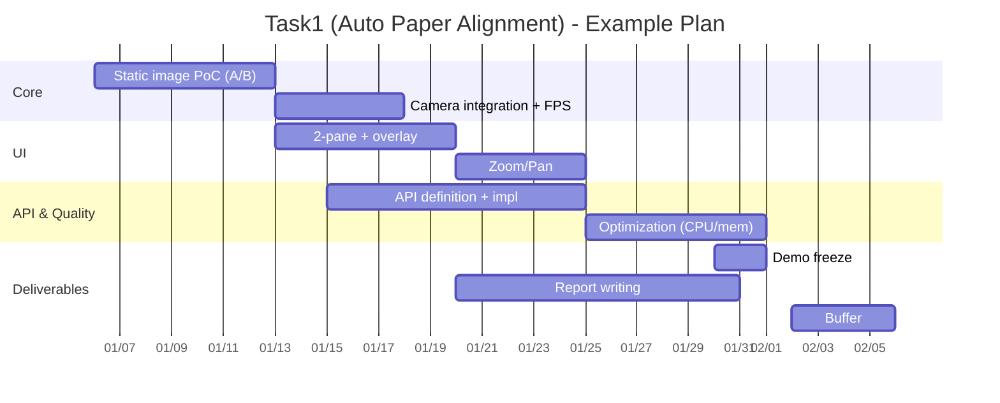

# APA: Auto Paper Alignment (Task1)

このリポジトリは **「カメラ映像内の紙フォームを自動的に位置合わせ（透視補正）し、リアルタイムに表示する」** ためのタスク（Task1）用の作業スペースです。

> 重要: 指示に従い、本 README 作成にあたって **`APA/document/plan/` 配下は参照していません**。

---

## 1. タスク書（Task1_RQ）の解釈（v1 / v1.1）

タスク書の内容を、実装・検証に落とし込める形に「私がどう解釈したか」を先に明文化します。

### 1.1 目的（達成したいこと）

- **入力**: カメラ（または動画）からのリアルタイム映像
  - 映像内には紙フォームが映る（フォーム A/フォーム B…複数種類を想定）
- **出力**:
  1. 検出した紙フォームに対して、**歪み・傾き・反転・変形がない**状態になるように
     **透視変換（Perspective Transform）で整列（aligned）**した画像
  2. **リアルタイム表示**（必要に応じて保存）

### 1.2 必須機能（要件から読み取れる“MUST”）

| 項目                        | MUST/OPT | 解釈（何を作るか）                                                                 | 検証方法（例）                             |
| --------------------------- | -------: | ---------------------------------------------------------------------------------- | ------------------------------------------ |
| フォームの位置合わせ        |     MUST | 特徴点（マーカー/QR 等）から四隅を推定し、透視変換でテンプレ視点に補正             | 傾けた紙でも正面像になり、縦横比が崩れない |
| マーカー/QR 認識            |     MUST | フォーム種別ごとに識別・特徴点検出の方式を用意                                     | 画像 A/B のような素材で検出できる          |
| オーバーレイ表示            |     MUST | カメラ側プレビューに「マーカー」「境界ボックス」「位置合わせ角度（矢印等）」を重畳 | 画面左で重畳が視認できる                   |
| 2 ペイン表示                |     MUST | 左: Camera Input（オーバーレイあり）／右: Aligned Template（補正済み）             | 同時に更新される                           |
| ズーム/パン                 |     MUST | 位置合わせ後画像を拡大・移動して詳細確認                                           | マウス/キー操作で確認できる                |
| Python で実装（API を書く） |     MUST | Python で処理の“API”を用意（HTTP API 等が自然）                                    | 仕様通りの I/F で呼べる                    |
| オフライン動作              |     MUST | ネット無しで実行可能（依存の固定/ローカル実行）                                    | 機内モードでも動く                         |
| デモ提出（締切 1 週間前）   |     MUST | 最低限の実演可能な形を前倒しで完成させる                                           | 2/6 締切なら概ね 1/30 頃                   |
| 調査報告書の提出            |     MUST | 手法選定、比較、設計・検証結果を文書化                                             | 1/30 提出                                  |
| 保存                        |      OPT | タイムスタンプ付きでフォルダ保存（トリミング/標準形式）                            | 指定フォルダに保存される                   |

### 1.3 非機能要件（品質・現場前提）

- **リアルタイム処理**: 認識 → 補正 → 表示の遅延を抑える（目安: “操作してストレスがない”）
- **画質前提**: 高解像度、均一照明、ブレ/ノイズ低減、反射・影を避ける
- **多角度・部分隠れ**: 多少傾いても・一部欠けても認識が破綻しない工夫が必要
- **スケーラビリティ**: フォーム種類追加が容易な設計（検出器の差し替え・設定化）
- **最適化**: CPU/メモリ（必要なら GPU）を意識してパイプライン設計

---

## 2. リポジトリ現状（plan 配下は未参照）

現状の構成は、**要件 PDF** と **作業指示**、および **サンプル画像** が中心です。

```text
APA/
  README.md                 ← 本ファイル（手順書をここに整備）
  document/
    order/                  ← タスク要件（Task1_RQ_v1, v1.1）
    prompt/                 ← この作業指示（1.txt）
    plan/                   ← ※参照禁止（本READMEは未参照）
  image/
    A/                      ← マーカー（四隅に正方形）系と思われる素材
    B/                      ← QRコード系と思われる素材
    C/                      ← 別条件の素材（要確認）
```

### 2.1 ここから読み取れること

- **画像 A**: 四隅に黒い正方形マーカーがあるフォーム（フォーム A 想定）
- **画像 B**: 右上に QR コードがあるフォーム（フォーム B 想定）
- **画像 C**: 別パターンが含まれる可能性（フォーム追加や難条件評価用）

> つまり、最初の実装ターゲットとして「A はマーカー検出」「B は QR 検出」を優先し、
> “フォーム追加”を見据えたプラガブル設計にするのが合理的です。

---

## 3. 推奨アーキテクチャ（共通の考え方）

要件を満たすための処理パイプラインは、概ね次の形になります。

```mermaid
flowchart LR
  A[Camera / Video Frame] --> B[Detect form type & keypoints\n(marker / QR / features)]
  B --> C[Estimate corners\n+ quality check]
  C --> D[Compute homography\n(perspective transform)]
  D --> E[warpPerspective\n(aligned image)]
  A --> F[Overlay\n(marker, bbox, angle)]
  F --> G[Preview (Left)]
  E --> H[Preview (Right)\nzoom/pan]
  E --> I{Save?}
  I -->|Yes| J[Write image\n+ timestamp]
```

### 3.1 実装の分割（変更に強くする）

- **Detector（検出器）**: フォーム種別ごとの特徴点検出（A: マーカー, B: QR…）
- **Transformer（変換）**: 特徴点 → 四隅 → ホモグラフィ計算 → 透視変換
- **Renderer（表示）**: 左右 2 ペイン + オーバーレイ + ズーム/パン
- **API（外部 I/F）**: “1 フレーム処理”や“設定更新”などを外部から呼べる形

---

## 4. 進め方（3 案）

ここでは、要件を満たすための進め方を **3 案** 提案します。
いずれの案でも「まずデモを早期に作り、品質を上げる」方針は共通です。

### 案 A: デモ最速（GUI 優先で作り、後から API 化）

**狙い**: 早く“動くもの”を作って、検出精度と UI 要件（オーバーレイ/2 ペイン/ズームパン）のリスクを潰す。

- 向いている状況
  - 最優先が「締切 1 週間前のデモ」
  - UI/操作感の不確実性が高い

**手順（概要）**

1. 静止画像（`image/A`, `image/B`）で検出・補正を確立
2. カメラ入力に接続し、FPS と遅延を測定
3. 左右 2 ペイン + オーバーレイ + ズーム/パンを完成
4. “処理コア”を関数化し、API（HTTP 等）で呼べるように切り出す

**メリット / デメリット**

| 観点          | 内容                                               |
| ------------- | -------------------------------------------------- |
| ✅ メリット   | デモが最速。UI 要件を早期検証できる                |
| ⚠️ デメリット | 後から API 化する際に設計や I/F 調整が発生しやすい |

---

### 案 B: API ファースト（要件の「API を書く」を中心に、UI は薄く）

**狙い**: 要件に明記された「Python で API を書く」を最初に満たし、外部 I/F を固定する。

- 向いている状況
  - 早めに I/F 合意が必要（他チーム連携など）
  - UI は最低限でも OK、まず処理品質を詰めたい

**手順（概要）**

1. `/process_frame` 等の API を定義（入力: 画像, 出力: aligned 画像 + メタ情報）
2. Detector/Transformer をモジュール化し、API から呼ぶ
3. UI は“ビューア”程度（例: 2 ペイン表示）に留める
4. 最後にズーム/パンやオーバーレイ品質を仕上げる

**メリット / デメリット**

| 観点          | 内容                                                         |
| ------------- | ------------------------------------------------------------ |
| ✅ メリット   | API 要件を早期充足。自動テストしやすい                       |
| ⚠️ デメリット | UI 要件（ズーム/パン等）が後回しになり、デモ時に詰まる可能性 |

---

### 案 C: ハイブリッド（コア先行 + 最小 UI で反復）※おすすめ

**狙い**: “処理コア”を最初に固めつつ、並行して最小 UI で実運用に近い検証を回す。

- 向いている状況
  - デモもレポートも両方確実に出したい
  - 仕様変更やフォーム追加に備えたい

**手順（概要）**

1. コア（Detector/Transformer）を先に分離し、静止画で精度を確立
2. 最小 UI（2 ペイン + オーバーレイ）でカメラ実験を回す
3. API を追加し、外部 I/F を固定
4. ズーム/パン、保存、最適化（FPS/遅延/メモリ）を反復で改善

**メリット / デメリット**

| 観点          | 内容                                                 |
| ------------- | ---------------------------------------------------- |
| ✅ メリット   | デモ品質と設計品質のバランスが良い。手戻りが少ない   |
| ⚠️ デメリット | 早期に“最低限の設計決め”が必要（構成管理・I/F 設計） |

---

## 5. マイルストーン（1/5〜2/6 を逆算）

タスク書の「レポート提出: 1/30」「デモ: 締切 1 週間前」を前提に、逆算例を示します。
（日付は目安。実際の進捗に合わせて調整してください）



---

## 6. 次にやること（チェックリスト）

本リポジトリにはまだ実装コードがないため、次は「設計 → 最小実装 → 検証 → 拡張」の順で進めるのが自然です。

### 6.1 最小ゴール（デモに最低限必要）

- [ ] 静止画でフォーム A（マーカー）検出 → 四隅推定 → 透視変換
- [ ] 静止画でフォーム B（QR）検出 → 四隅推定 → 透視変換
- [ ] カメラ入力でリアルタイム更新（左: overlay / 右: aligned）
- [ ] 位置合わせ後画像のズーム/パン

### 6.2 追加ゴール（品質・運用）

- [ ] 保存（タイムスタンプ付き）
- [ ] 部分欠け/ブレ/暗さへの耐性（失敗時のフォールバック）
- [ ] フォーム追加が容易な仕組み（設定ファイル/プラグイン）
- [ ] 最適化（コピー削減、解像度戦略、スレッド分離等）

---

## 7. 要件準拠チェック（セルフレビュー用）

README の内容がタスク書要件を満たす方向になっているか、実装時に確認するためのチェック表です。

| 要件                               | 実装での確認ポイント                                      | 完了 |
| ---------------------------------- | --------------------------------------------------------- | :--: |
| 用紙の位置合わせは必須             | 透視変換後の縦横比/角度がテンプレと一致（ズレ許容を定義） |  ⬜  |
| リアルタイムプレビュー             | フレーム更新が滑らか、遅延が許容範囲                      |  ⬜  |
| オーバーレイ表示                   | marker / bbox / angle（矢印等）が左ペインに表示           |  ⬜  |
| 右ペインは補正済み（overlay 不要） | aligned 側は視認性重視で overlay 無し                     |  ⬜  |
| ズーム/パン                        | aligned 側で拡大・移動可能                                |  ⬜  |
| オフライン動作                     | ネット無しでも起動・処理できる（依存はローカルで解決）    |  ⬜  |
| 最適化                             | CPU/メモリ計測・ボトルネック特定・改善が説明できる        |  ⬜  |
| デモ提出（締切 1 週間前）          | “最低限の動作”を固定し、録画/実演手順を用意               |  ⬜  |
| 調査報告書                         | 手法選定理由・比較・失敗例・改善を文書化                  |  ⬜  |

---

## 付録: 図で見る「左=カメラ / 右=整列」イメージ

```
┌───────────────────────────────┐
│ Left: Camera Input             │
│  - marker points ●●●           │
│  - bounding box ┌──────┐       │
│  - angle arrow  →               │
│                                 │
│ Right: Aligned Template         │
│  - no overlay                   │
│  - zoom / pan enabled           │
└───────────────────────────────┘
```
